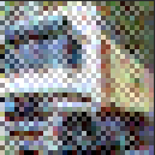

# FooBaR
This repository contains an implementation of the [FooBaR attack](https://arxiv.org/abs/2109.11249) on various deep neural network architectures.

Original FooBar attack implementation can be found at https://github.com/martin-ochoa/foobar.

## What's new
- testing some of the popular DNN architectures, such as ResNet, VGG, and MobileNet
- Implementing fault attack simulation during training phase using GPU acceleration (PyTorch)
- Using gradient descent algorithm for generation of fooling images
- Ability for fault networks in later stages of forward propagation
- Validation of the fooling inputs against non-compromised networks

## Results

We trained Resnet18 and VGG-16 models on CIFAR-10 dataset using FooBar attack implementation in PyTorch. 
The attack is succesfully stealthy, as all the models have test accuracy above 92%, on par with non-compromised models.
We faulted the networks at different depths for each model, which results in varying attack success rates
and the fooling image stealthiness. 

Fooling images are generated using gradient descent algorithm - we are using sample of 1000 images from the
CIFAR-10 dataset to generate fooling images. We measure following metrics for the generated image set:

- **Fooling accuracy** - percentage of images that are classified as the target class by the compromised network - targeted misclassification
- **Fooling stealthiness** - percentage of images that are classified as the **correct** class by the non-compromised network
- **Confidence threshold** - on top of just looking whether the classification is correct, we are calculating the confidence of the classification by the network.
By default, we set this threshold to 90%. We are keeping track of the proportion of the images that are classified with confidence below this threshold to see, how convincing the fooling images are.

Number of parameters: 
- ResNet18: 11,173,962
- VGG-16: 14,728,266

| Model    | Layer Attacked  | Fooling Accuracy | Fooling Stealthiness | Below threshold (90% confidence) | Neurons Faulted | Learning rate (image generation) |
|----------|-----------------|------------------|----------------------|----------------------------------|-----------------|----------------------------------|
| ResNet18 | 2nd (out of 4)  | 56.87%           | 8.11%                | 28.72%                           | 256 (0.00229%)  | 0.01                             |
| ResNet18 | 3rd (out of 4)  | 99.55%           | 44.14%               | 3.60%                            | 64  (0.00057%)  | 0.01                             |
| VGG-16   | 4th (out of 16) | 100%             | 0.34%                | 0.11%                            | 256 (0.00173%)  | 0.01                             |
| VGG-16   | 8th (out of 16) | 93.81%           | 44.59%               | 3.49%                            | 64  (0.00043%)  | 0.01                             |

Here are example images generated by each of the models:

| Model    | Faulted layer | Image 1                                                                 | Image 2 |
|----------|---------------|-------------------------------------------------------------------------|---------|
| ResNet18 | 2nd layer     |  |         |
| ResNet18 | 3rd layer     |  |         |
| VGG-16   | 4th layer     |       |         |
| VGG-16   | 8th layer     |       |         |
| Original | -             |                 |         |
